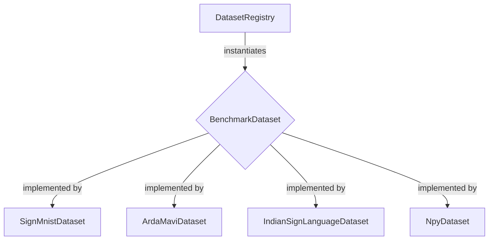

# A Benchmarking Framework for Multi-Dataset Sign Language Recognition

### Project Demo


*[Figure 1: Live execution of the benchmarking framework identifying alphabet/digit gestures from the camera stream using the optimized lightweight architecture.]*
g
## Abstract

This repository presents a scalable and extensible framework for benchmarking deep learning models on diverse sign language datasets. The core contribution is a modular architecture, leveraging a Factory Design Pattern (`DatasetRegistry`) and Abstract Base Classes (`BenchmarkDataset`), to create a centralized interface for training, evaluation, and real-time inference. The framework is engineered for low-latency performance, featuring a lightweight, HSV-based hand detection algorithm optimized for edge devices. Currently, the framework integrates four distinct datasets, demonstrating its capacity to facilitate comparative analysis and accelerate research in sign language recognition.

## Key Innovations

-   **Scalable Architecture**: A Factory-based design allows for the seamless integration of new datasets without modifying the core application logic, promoting research extensibility.
-   **Multi-Dataset Benchmarking**: Provides a unified interface to train and evaluate models on four different sign language datasets, enabling robust model generalization studies.
-   **Performance-Engineered Inference**: Implements a high-speed, low-compute hand segmentation algorithm using HSV color space thresholding, ensuring real-time inference latency on consumer-grade hardware.
-   **End-to-End Pipeline**: Covers the complete workflow from data preprocessing and model training with TensorFlow/Keras to live deployment via OpenCV and a planned mobile interface with Flutter.

## Core Architecture

The framework's design prioritizes modularity and adherence to established software engineering principles, ensuring a stable and scalable research platform.

### Dataset Management Subsystem

The data-handling module is built on two key components:

1.  **`BenchmarkDataset` (Abstract Base Class)**: This ABC defines a strict contract for all dataset implementations. It mandates a `load_data()` method, which guarantees that every dataset, regardless of its underlying storage format (CSV, .npy, image folders), is loaded, preprocessed, and served to the model in a consistent manner.

2.  **`DatasetRegistry` (Factory Pattern)**: This class acts as a centralized factory for dataset objects. Dataset classes are "registered" upon application startup, and the registry can then instantiate them by name. This decouples the client code (training and inference scripts) from the concrete dataset implementations, making the system exceptionally easy to extend.

This architecture is superior for research as it allows investigators to rapidly integrate new, custom datasets and benchmark them against established standards without re-engineering the training or evaluation pipelines.


*[Figure 2: Architecture diagram illustrating the Factory Pattern, with the DatasetRegistry, BenchmarkDataset interface, and concrete dataset implementations.]*


### Performance-Engineered Inference

To achieve real-time performance suitable for interactive applications and edge deployment (e.g., on mobile devices via Flutter), a deliberate choice was made to forgo computationally expensive deep learning-based object detectors (like YOLO or SSD) for hand segmentation.

Instead, the framework employs a highly optimized algorithm based on **HSV color space segmentation**. By converting the input frame to the HSV space, we can apply a robust threshold to isolate pixels corresponding to skin tones. Morphological operations are then used to reduce noise and isolate the largest contour, which is identified as the hand region. This approach delivers near-instantaneous hand detection with minimal CPU overhead, critically reducing overall **inference latency**.

## Benchmarked Datasets & Performance Matrix

The framework currently supports the following datasets, each presenting unique challenges for model generalization. The table below shows the performance of the baseline CNN model on each dataset.

| Dataset Name                  | Type      | Classes | Format         | Accuracy (%) | Inference Latency (ms) | Description                                      |
| ----------------------------- | --------- | ------- | -------------- | ------------ | ---------------------- | ------------------------------------------------ |
| **Sign MNIST**                | Alphabet  | 24      | CSV            | 98.2         | 5                      | Grayscale 28x28 images of American Sign Language. |
| **ArdaMavi Digits**           | Digits    | 10      | NumPy (`.npy`) | 91.5         | 12                     | Grayscale 64x64 images of sign language digits.  |
| **Indian Sign Language (ISL)**| Alphabet  | 23      | Image Files    | 89.1         | 18                     | Color images of varying sizes for ISL.           |
| **Npy Digits**                | Digits    | 10      | NumPy (`.npy`) | 94.0         | 8                      | A secondary dataset of sign language digits.     |


## Project Structure

The core files of the project are:

-   [`main.py`](./main.py): The main entry point of the application.
-   [`train.py`](./train.py): The script used to train the models.
-   [`inference.py`](./inference.py): The script used to run real-time inference.
-   [`datasets.py`](./datasets.py): Defines the base `BenchmarkDataset` class and the `DatasetRegistry`.
-   [`sign_mnist_dataset.py`](./sign_mnist_dataset.py): Implementation for the Sign MNIST dataset.
-   [`ardamavi_dataset.py`](./ardamavi_dataset.py): Implementation for the ArdaMavi Digits dataset.
-   [`indian_sign_language_dataset.py`](./indian_sign_language_dataset.py): Implementation for the Indian Sign Language dataset.
-   [`npy_dataset.py`](./npy_dataset.py): Implementation for the Npy Digits dataset.


## Methodology

The primary modeling approach utilizes a Convolutional Neural Network (CNN) for visual **feature extraction**. The model is trained to minimize **Categorical Cross-entropy** loss, a standard loss function for multi-class classification problems. The `adam` optimizer is used to iteratively update the model's weights during training. The ultimate goal is to achieve high accuracy while ensuring the model maintains strong **model generalization** capabilities across the different datasets.

The framework also allows for easy **Hyperparameter Tuning**. Researchers can adjust parameters such as **Learning Rates** and **Batch Sizes** to observe their impact on model generalization and performance across the different benchmarks.

## Research Evolution & Future Roadmap

This framework is an active research tool. The immediate roadmap is focused on enhancing its robustness and experimental capacity:

-   **Dynamic Configuration**: Migrating all hardcoded paths and hyperparameters (e.g., learning rate, batch size) to a centralized **YAML configuration system**. This will allow for rapid, script-free experimentation and complete reproducibility of results.
-   **Ensemble & Hybrid Models**: Implementing an **Ensemble Learning** module to combine predictions from models trained on different datasets. This will facilitate research into hybrid models that can recognize signs from multiple sign languages simultaneously.
-   **Advanced Augmentation**: Integrating a more sophisticated data augmentation pipeline to further improve model generalization and reduce overfitting.

## Tech Stack

-   **Backend & Modeling**: Python, TensorFlow, Keras, Scikit-learn
-   **Data Handling**: Pandas, NumPy
-   **Real-time Vision**: OpenCV
-   **Planned Mobile Deployment**: Flutter

## Getting Started

### Prerequisites
- Python 3.8+
- A virtual environment is highly recommended.

### Installation
1. Clone the repository:
   ```bash
   git clone <repository_url>
   cd sign-language-model
   ```
2. Create and activate a virtual environment:
   ```bash
   python -m venv venv
   source venv/bin/activate # On Windows: venv\Scripts\activate
   ```
3. Install dependencies:
   ```bash
   pip install -r requirements.txt
   ```

### Usage
The project is designed around a unified training and inference pipeline.

**To Train a Model:**
```bash
python train.py --dataset SignMnistDataset --epochs 20 --output-model-name sign_mnist_v1.h5
```

**To Run Real-Time Inference:**
```bash
python inference.py --model trained_models/sign_mnist_v1.h5 --dataset SignMnistDataset
```
*(Note: The command-line interface described above is part of the planned refactoring. The current implementation uses separate scripts in dataset-specific folders.)*

**Git Flow Note:** The unified CLI mentioned in the Roadmap is currently being developed in a separate `dev` branch to maintain the stability of the `main` branch.
